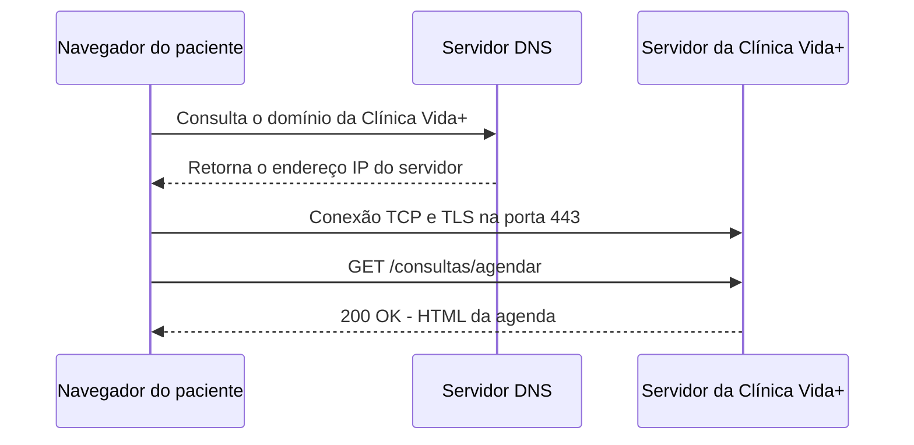

# Arquitetura da Clínica Vida+

## O caminho de uma requisição

Quando um paciente acessa o site da Clínica Vida+, o navegador precisa primeiro descobrir onde o servidor do site está localizado. Para isso, o navegador consulta um servidor DNS, que transforma o nome do domínio em um endereço IP. Depois de receber o endereço IP, o navegador estabelece uma conexão segura com o servidor utilizando HTTPS. O servidor recebe a requisição, processa o pedido e devolve uma resposta para o navegador, que mostra a página ao paciente.



## Evidência do DNS

Foi realizada uma consulta DNS utilizando o comando `nslookup` para verificar o endereço IP do domínio `github.com`.

```text
Servidor:  menuvivofibra
Address:   fe80::9a7e:caff:fe95:8260

Não é resposta autoritativa:
Nome:     github.com
Address:  4.228.31.150
```

Essa consulta demonstra o funcionamento do DNS, que permite transformar um nome de domínio, como `github.com`, em um endereço IP que pode ser utilizado para localizar o servidor na internet.

## Evidência do HTTP

Foram observadas requisições realizadas pelo navegador por meio da aba Network do DevTools. A tabela abaixo apresenta o método utilizado, o recurso solicitado e o código de status retornado pelo servidor.

| Método | Recurso | Status |
|--------|---------|--------|
| GET | / | 200 |
| GET | /43296-25b2fc973fb91e3.js | 200 |
| GET | /3654-720cab66298d962.js | 200 |
| GET | /pagina-que-nao-existe | 404 |

O código de status `200` indica que a requisição foi realizada com sucesso. Já o código `404` indica que o recurso solicitado não foi encontrado no servidor.

## Por que o formulário de agendamento precisa de HTTPS

O formulário de agendamento da Clínica Vida+ precisa utilizar HTTPS porque poderá receber dados sensíveis dos pacientes, como CPF, telefone e data de nascimento. O HTTPS protege essas informações durante o envio pela internet utilizando criptografia, evitando que os dados sejam facilmente interceptados por pessoas não autorizadas. Além disso, o uso de HTTPS aumenta a privacidade e a segurança dos pacientes durante o agendamento da consulta.